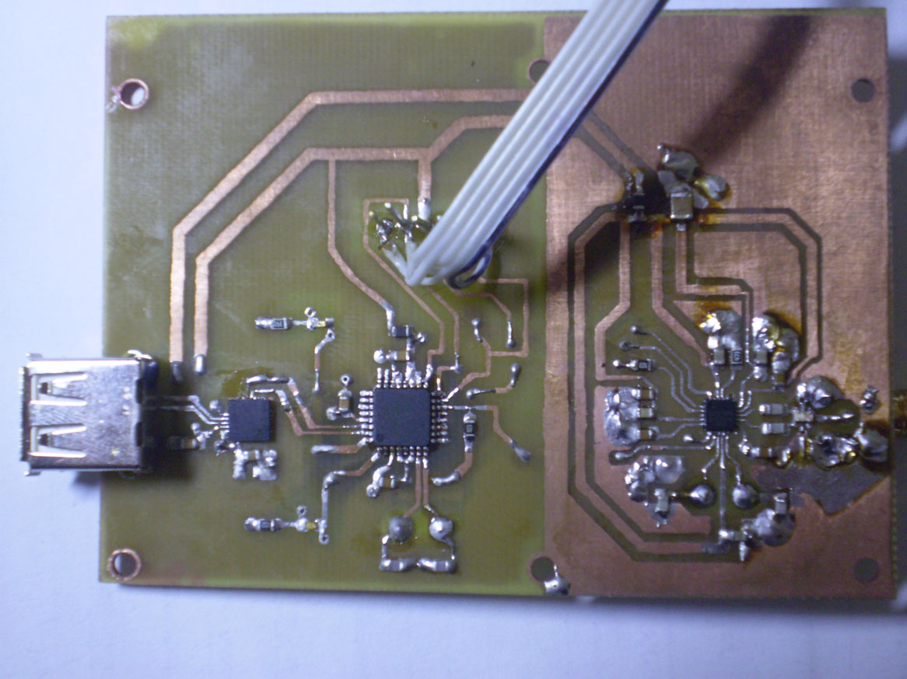
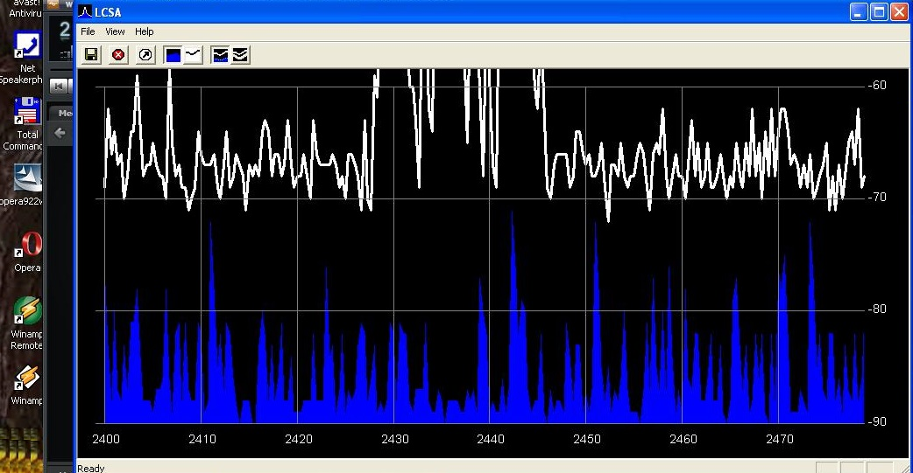
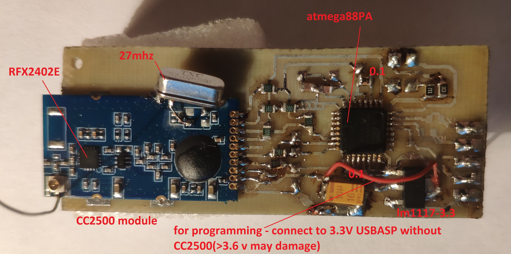
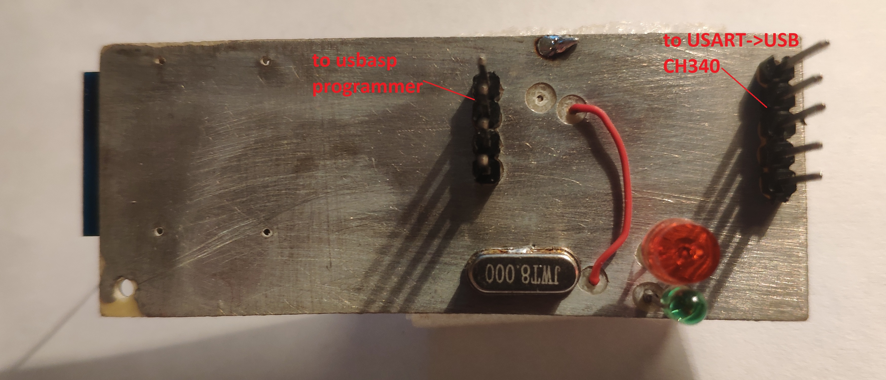
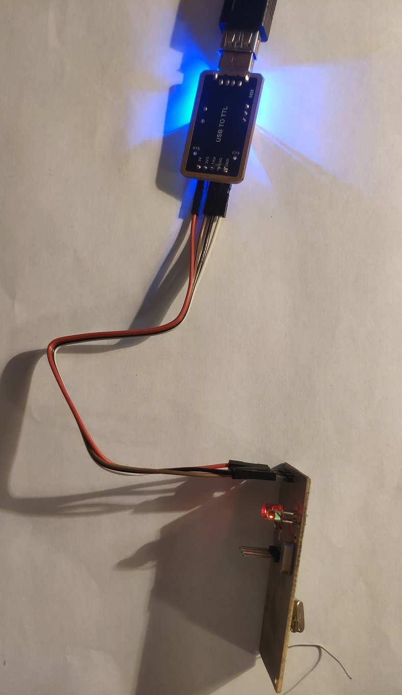
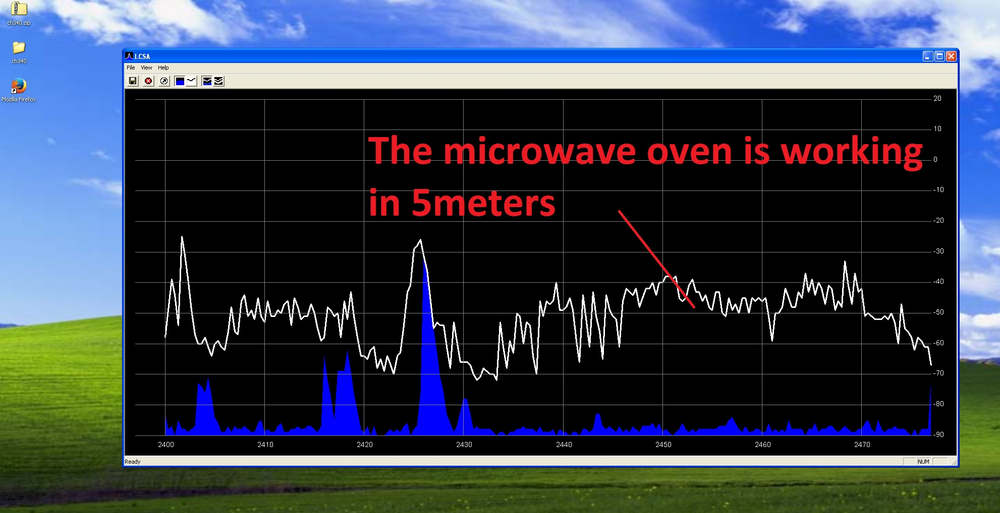

# Own 2.4-GHz Spectrum Analyzer

Back in 2008, in Circuit Cellar magazine I found an article on making a low-cost 2.4Ghz spectrum analyzer on chip CC2500. You can find the original description in the folder OriginalSources.

There was an error in the article - on the atmega48 scheme, and the hex file for atmega88.
They were also not attached fuses.
It took a lot of time trying to assemble the device.
But I was successful, and the device worked.
There was no limit to my joy.
Photo of my old(17.03.2008) board

I was looking at the range of the router and my bluetooth devices.

Years later, I decided to repeat this device to measure the radiation of a microwave oven.
Instead of the CP2102, I used a CH340 board.

I used СС2500 module and replaced the 26Mhz quartz to 27Мhz.
I used UsbAsp for load firmware.
You can find the hex file(atmega48, atmega88) and fuses in the folder
Binary.

Is used the LCSA program to observe the spectrum. But it didn't work on Windows 10.

I have installed a Vmware Workstation, Windows XP to it and CH340 driver.
And lo and behold, everything worked

I put a mug of water in the microwave and started looking at the spectrum.

The original sources are written for ICCAVR (ImageCraft).
I was trying to rewrite the source code for a modern IDE Microchip studio
(Src folder).
But when loading my program, i have two problems:
1. If set 26Mhz quartz, the LCSA program says an erroneous quartz value.
2. LCSA shows triangles. Apparently, the compiler simplifies the code. It must be added asm("nop") to the while cycles in code.

Because of these issues, I had to use spectrum.hex from the original folder.

To make you want to do:
- rewrite the code for a modern development environment
- rewrite LCSA programm

Good luck.
